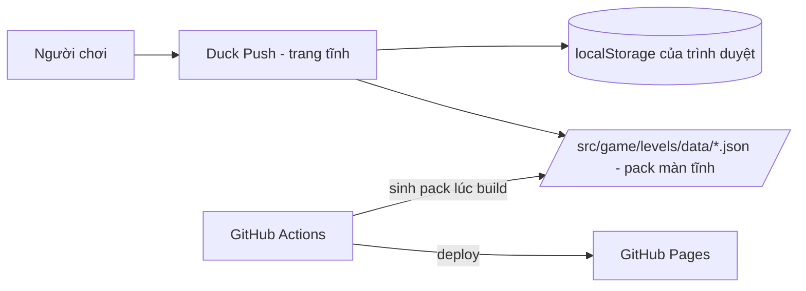
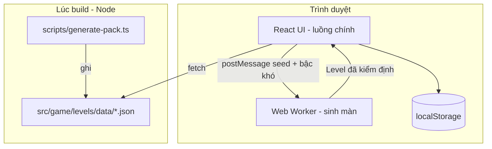

# Kiến trúc

> **Trả lời:** Hệ thống ghép lại thế nào, ranh giới giữa các phần ở đâu?
> **Trạng thái:** 🟢 đủ
> **Cập nhật:** 2026-09-04 · commit feat/v1-core
> **Cập nhật khi:** thêm/bỏ một module · đổi cách hai module nói chuyện

## 1. Context — hệ thống nằm giữa ai với ai

Không có máy chủ ứng dụng, không có cơ sở dữ liệu, không có dịch vụ ngoài. Đó là hệ quả
trực tiếp của trần chi phí 0 đồng trong `overview.md`.

## 2. Container — những khối chạy được

Một lõi, ba nơi chạy. `core/` là code duy nhất biết luật Sokoban; nó chạy trong Node lúc
build, trong Worker lúc chơi, và trong Vitest lúc test — không có bản cài đặt thứ hai.

## 3. Module và ranh giới

| Module | Trách nhiệm một câu | Được phép gọi | **Không** được gọi |
| --- | --- | --- | --- |
| `game/core/` | Luật chơi, dò bế tắc, solver, sinh màn — TS thuần | chỉ `core/` | React · DOM · `window` · `localStorage` · `fetch` |
| `game/session/` | Một ván đang chơi: lịch sử, undo/redo, bộ đếm, vệt đường đi | `core/` | React · DOM · `localStorage` |
| `game/storage/` | Đọc/ghi `localStorage`, kiểm dữ liệu, hạ cấp an toàn | `core/types` | `core/solver` · React |
| `game/levels/` | Tải pack JSON và đổi sang `Level` | `core/level` · `fetch` | React |
| `game/workers/` | Cầu nối giữa UI và `core/generator` qua `postMessage` | `core/` | React · `localStorage` |
| `hooks/` | Nối `session` + `storage` vào React | `session/` · `storage/` · `levels/` · `workers/` | `core/solver` trực tiếp |
| `views/`, `components/` | Hiển thị và thao tác | `hooks/` · `core/types` | `storage/` trực tiếp · `core/solver` |
| `scripts/` | Sinh pack lúc build | `core/` | React · DOM |

Mũi tên chỉ đi một chiều: `views → hooks → session/storage → core`. Không có chiều ngược.

## 4. Luồng dữ liệu của đường đi quan trọng nhất

**Một nước đi** — đường này chạy vài trăm lần mỗi ván nên nó quyết định mọi thứ khác:

1. Người chơi bấm phím mũi tên. `useKeyboardControls` chặn hành vi cuộn mặc định và
   gọi `move(direction)`.
2. `useSokobanGame` gọi `applyMove(session, direction)` trong `game/session/`.
3. `applyMove` gọi `step(state, direction)` trong `core/rules` — hàm **duy nhất** biết luật.
   Nước không hợp lệ thì trả về **đúng object session cũ**, React bỏ qua render.
4. Nước hợp lệ: trạng thái cũ được đẩy vào `past`, bộ đếm tăng, vệt đường đi cắt còn 12 ô,
   `findFrozenBoxes` chạy lại trên bảng ô chết đã cache theo bàn cờ.
5. React render lại bàn cờ; ô di chuyển bằng `transform` 120ms.
6. Nếu `isSolved` thì `recordSolve` cập nhật kỷ lục và `saveProgress` ghi xuống
   `localStorage` — ghi hỏng chỉ trả về `false`, không làm hỏng ván.

**Sinh một màn ngẫu nhiên** — đường duy nhất có thể chậm:

1. UI gọi `requestRandomLevel(difficulty)`; nút vào trạng thái chờ.
2. `generatorClient` `postMessage` seed + bậc khó sang Worker.
3. Worker gọi `generateLevel` trong `core/generator`: dựng bản đồ từ phòng mẫu → đặt thùng
   bằng đi lùi từ trạng thái thắng → chạy `solve` với ngân sách chặt → nhận hoặc vứt.
4. Quá `maxAttempts` thì hạ chuẩn (bàn nhỏ hơn, ít thùng hơn) chứ không treo.
5. Worker trả `Level` kèm `optimalPushes`; UI vào màn chơi và ghi seed vào URL.

## 5. Tech stack

| Lớp | Công nghệ | Biện minh |
| --- | --- | --- |
| Khung ứng dụng | Next.js 16, `output: "export"` | Xuất HTML tĩnh, host GitHub Pages, 0 đồng hạ tầng — ADR-0002 |
| UI | React 19 + Tailwind CSS v4 | Token thiết kế khai báo trong CSS, cùng lối với các game anh em |
| Vẽ bàn cờ | DOM + CSS Grid, **không canvas** | Game theo lượt, bàn ≤ 12×12. DOM cho sẵn focus, `aria`, bàn phím, reduced-motion — ADR-0002 |
| Ngôn ngữ | TypeScript strict + `noUncheckedIndexedAccess` | Lõi toàn thao tác chỉ số mảng; đây đúng là chỗ cần nó |
| Sinh màn | Lai: phòng mẫu + đi lùi + solver có ngân sách | ADR-0003 |
| Solver | A\* trên không gian đẩy, chuẩn hoá vùng người chơi | ADR-0004 |
| Lưu trữ | `localStorage` có `version` | Không tài khoản, không backend — ADR-0005 |
| Test | Vitest (unit) + Playwright (e2e) | Cùng bộ với `web-game-flappy-bird` |
